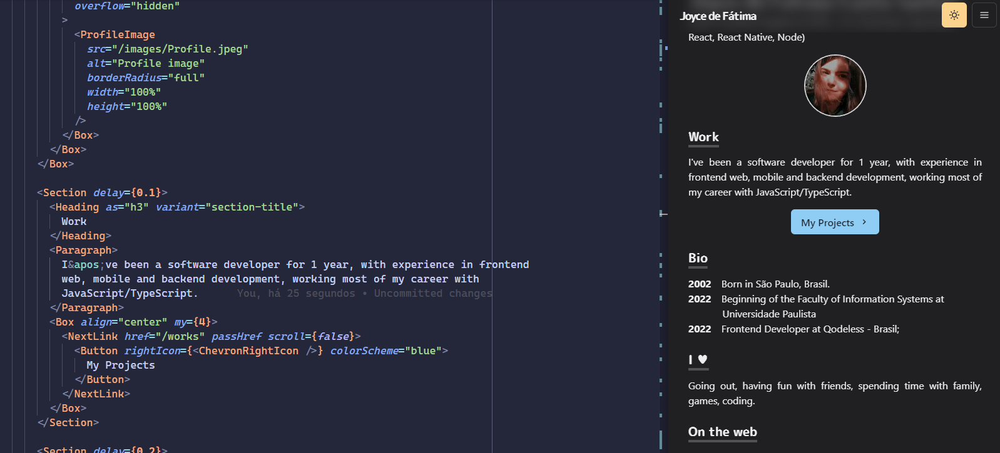

# Joyce Homepage

[https://portifolio-joycefatima.vercel.app/](https://portifolio-joycefatima.vercel.app/)



## Stack

- [Next.js](https://nextjs.org/) - A React framework with hybrid static & server rendering, and route pre-fetching, etc.
- [Chakra UI](https://chakra-ui.com/) - A simple, modular and accessible component library for React
- [Three.js](https://threejs.org/) - 3D library for JavaScript
- [Framer Motion](https://www.framer.com/motion/) - An animation library for React

## Project structure

```
$PROJECT_ROOT
│   # Page files
├── pages
│   # React component files
├── components
│   # Non-react modules
├── lib
│   # Static files for images and 3d model file
└── public
```
## License

MIT License.

You can create your own homepage for free without notifying me by forking this project under the following conditions:

- Add a link to [my homepage](https://www.craftz.dog/)

Check out [LICENSE](./LICENSE) for more detail.
